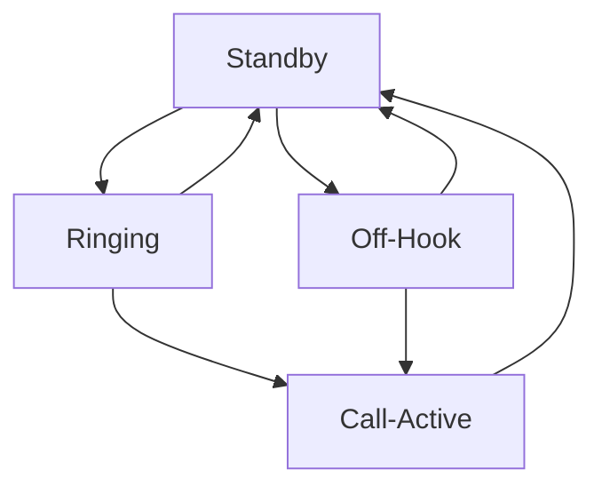

# General state

You can think how phone link firmware works internally from this flow chart:

```mermaid
graph TD;
    Standby --> Ringing
    Ringing --> Standby
    Ringing --> Call-Active
    Call-Active --> Standby
    Standby --> Off-Hook
    Off-Hook --> Standby
    Off-Hook --> Call-Active
```
