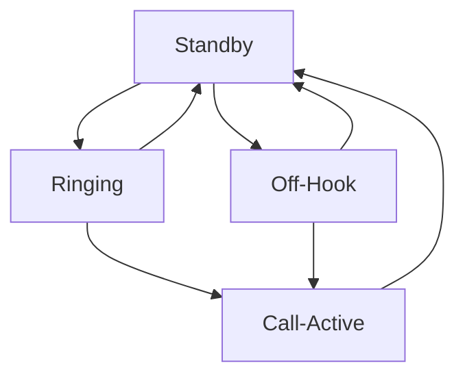

# General state

You can think how phone link firmware works internally from this flow chart:

## States
* Standby: System is waiting for calls or to intercept if the land phone is off-hook.
* Ringing: The bluetooth connected cellphone is riging, setting the phone off-hook will accept the call and move to Call-Active.
* Call-Active: Call is in progress, audio will be heard on the land phone.
* Off-Hook: Phone is currently off-hook, if user dials one or more numbers these will be relayed to the bluetooth connected cellphone to start a call.